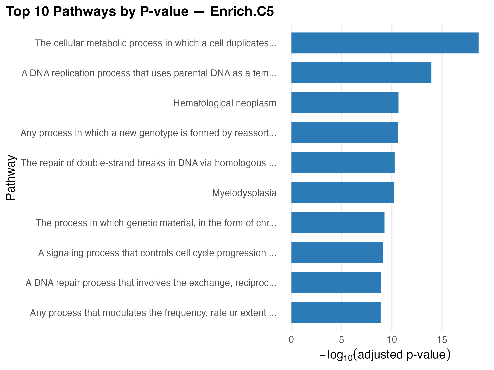
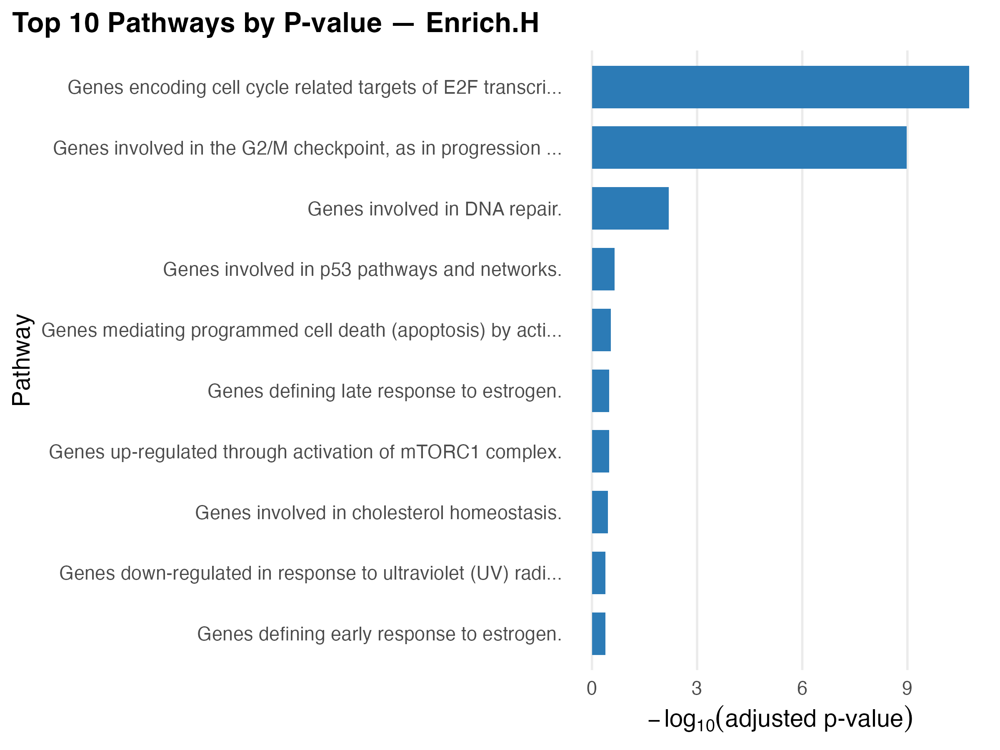
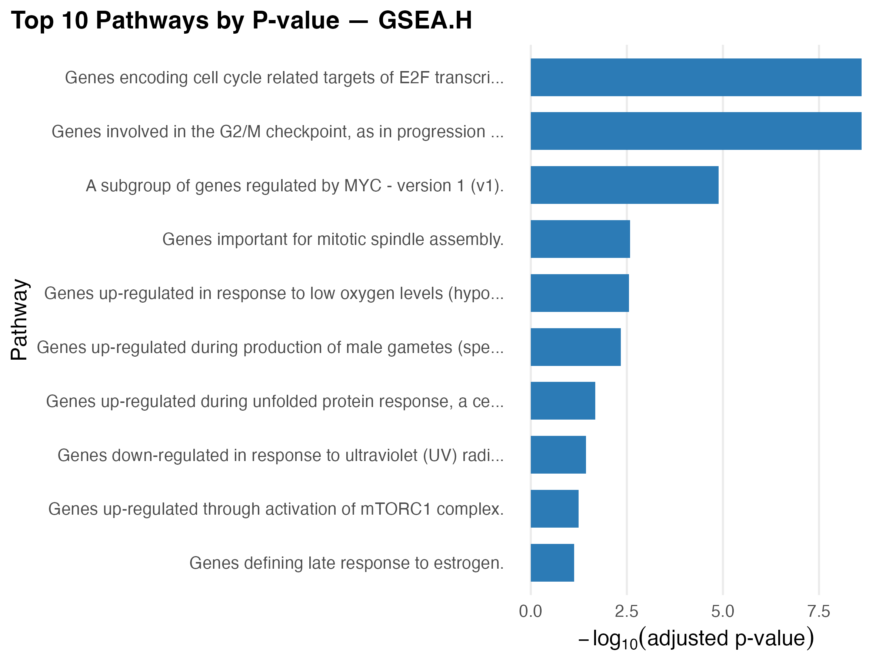

# Project Report

## Introduction

Breast cancer is an incredibly common cancer in the United States with
an estimated 316,950 new cases thus far in 2025, accounting for 15.5% of
all cancer diagnoses ([NCI n.d.](#ref-nciCancerBreastFemale)). Thus,
research in this type of cancer is vital to increasing the overall
health of the nation. A key area of interest now is in metastasis of the
cancer, which is when the tumor spreads from the original site. For
breast cancer, the most common type of metastasis is the tumor spread to
bone, or bone metastasis([Clézardin et al.
2021](#ref-clezardinBoneMetastasisMechanisms2021)). Additionally, as
science and medicine have developed, we now have the tools to identify
the genetic and molecular causes of breast cancer and create then create
targeted therapies to combat such causes. Thus, we are interested in
identifying genes associated with bone metastasis in breast cancer
patients.

Past research has shown that microRNAs (miRNAs), which are small pieces
of RNA that can block the protein production of messenger RNA, are
dysregulated in cancer([“Definition of
microRNA - NCI Dictionary of Cancer Terms -
NCI” 2011](#ref-DefinitionMicroRNANCI2011); [Puppo, Valluru, and
Clézardin 2021](#ref-puppoMicroRNAsTheirRoles2021a)). Furthermore,
researchers have identified the miRNA strand miR-24-2-5p as potentially
inhibiting tumor progression when overexpressed ([Puppo et al.
2024](#ref-puppoProtectiveEffectsMiR2425p2024)). Thus, in this study we
are interested in exploring which genes are differentially expressed
between cells with miR-24-2-5p overexpression and those without, while
controlling for the cell’s genotype. We will also explore the pathways
and gene ontologies most differentially expressed.

## Methods

### Data

We obtained data from the study of Puppo et al., which found that
overexpression of miR-24-2-5p reduced bone metastasis of breast cancer
([Puppo et al. 2024](#ref-puppoProtectiveEffectsMiR2425p2024)). The
dataset originally contained 15 samples, six with over expressed
miR-24-2-5p (treatment), six without (control), and three with miR-662,
which were removed from analysis because that miRNA strand had been
studied extensively and has a small sample size. Additionally, samples
belonged to one of two genotypes: Luc2-NW1 and Luc2. There were six
samples for each genotype. We are primarily interested in identifying
the most differentially expressed genes between the treatment and
control groups after controlling for genotype.  

### Quality Assesment

We will assess the quality of the data by examining the library size of
each sample, the distribution of the gene counts within samples, the
correlation between samples, and conducting principal component analysis
(PCA). Ideally the library size and distribution of gene counts within
samples should be relatively equal between samples. Additionally, we
expect that samples in the treatment group to be highly correlated with
other treatment samples and not correlated with control samples. After
conducting PCA, we expect to see that samples from the same biological
group (such as genotype) to cluster together.  

### Preprocessing

Before we begin more in depth analysis, we will first filter our genes
to ensure that low expressed genes are not considered in analysis. This
will ensure that we preserve our statistical power to identify
differently expressed genes. We will require a minimum count for at
least some samples of 10 and a minimum total count across all samples of
15. Then we will normalize the data using the trimmed mean of M-values
(TMM) method. This is the standard method of normalization for RNASeq
data. Normalization will ensure that our results are not skewed by
outliers.  

### Batch Effect Correction

Our data does not appear to have any obvious batch effects, so we will
use Surrogate Variable Analysis (SVA) to identify any batch effects in
our data. We will then remove the batch effects. To verify that we
correctly removed any batch effects we will also conduct PCA again and
compare our results. PCA offers a visual way of checking whether the
batch effect has been removed since we are looking for biological groups
to cluster with each other. We will also conduct heirarchical clustering
using the average linkage method both before and after correcting for
the batch affects. Samples from the same biological groups should be
clustered together.  

### Differential Analysis

Now we will be ready to perform differential gene expression analysis
using edgeR. EdgeR tends to be more robust with smaller sample sizes, so
it is appropriate for our study. We will filter out genes as described
above to remove lowly expressed genes. This will ensure that we conduct
fewer statistical tests, so we will preserve our power to make inference
on truly differntially expressed genes. We will use the False Discovery
Rate (FDR) to correct for multiple comparisons. This is a very common
method to accomplish this and will preserve power while maintaining a
low Type 1 error rate.  

### Functional Enrichment Analysis

Finally we will explore which type of genes are differentially
expressed. We will perform both overreprensation analysis based on the
hypergeometric distribution and gene set enrichment analysis (GSEA)
using Kegg pathways and three gene ontology domains (biological
processes, molecular function, and cellular component). This will inform
us as to what the differentially expressed genes mean in context.  

All analyses will use *α* = 0.05 and will be conducted in R version
4.5.1 ([**RCoreTeam2025?**](#ref-RCoreTeam2025)). Our data, analysis
code, and the results of differential expression analysis and the
results of functional enrichment analysis can be found on GitHub at
[this link.](https://github.com/hurstog/BIOS658-Final-Project)

## Results

### Data assessment, preprocessing, and batch affect correction

The distribution of library sizes and the distribution of gene counts
within samples are seen in the figures below. We see that the library
size of sample varies between each sample. The smallest library size is
13,944,515 and the largest is 18,955,021. Additionally, we see that that
the distribution of gene counts of each sample is highly skewed. These
results are consistent with what we expect from gene expression data,
but they highlight the need to normalize the data.

After we filtered the data to remove lowly expressed genes and
normalized the data using TMM, we had normalized gene counts we could
use in future analysis. After filtering, we retained data for 12,899
genes, compared to our original 66,963 genes. We calculated the
normalized counts per million reads (CPM). That way we could visualize
the distribution of the normalized gene counts of each sample, as seen
in the figure below. We see that the CPM distribution is much more
symmetric for each sample and each sample has similar median, min, and
max CPM.

Next, we created a heat map that visualized the pair wise correlation
coefficient, as calculated by the Pearson meth, between each sample. The
heatmap demonstrates that MDA samples are highly correlated with other
MDA samples and weakly correlated with MCF7 samples. On the other hand,
MCF7 samples are highly correlated with other MCF7 samples and weakly
correlated with MDA samples. Further investigating this shows that MDA
samples correspond to those with the genotype Luc2-NW1 while MCF7
samples correspond to the Luc2 genotype. Therefore, the correlation
matrix presented in the heat map make sense given our data. The samples
from the same genotype are highly correlated.

Principal component analysis resulted in the top 5 principal components
explaining 92.52% of the variance in the data. The plots of this
analysis is seen below. We expect that samples that are in the same
biological groups to be clustered. When we color the plot based on
sample genotype, we see that the two genotypes are highly clustered
together. When we color the plot based on treatment group we again see
that treatment samples tend to be clustered together and control samples
tend to be clustered together.

We also performed hierarchical clustering based on the top 10% of most
variable genes. We used the average linkage method and euclidean
distance to accomplish this clustering. The dendrograph created based on
these clusters are presented below. The figure shows that MCF7 samples
are clustered together and that MDA samples are clustered together,
which is similar to what the correlation matrix above demonstrated.
Again, this makes sense because MCF7 samples correspond to one genotype
(Luc2-NW1) and MDA samples correspond to a genotype (Luc).

The results of PCA and hierarchical clustering indicated that we likely
did not have batch effects in our data. This is because these analyses
resulted in grouping based on the biological groups we have defined.
That said, we used surragate variable analysis (SVA) to rigorously check
for batch effects since we did not have any information about batches
from the data. Our analysis affirmed that there were no batch effects in
the data. Therefore, we did not correct for any effects. Additionally,
we did not need to redo PCA and hierarchical clustering to confirm batch
effects were removed.

### Differential expression analysis

Once we ensured the quality of the data and confirmed that there were no
batch effects present in the data, we were able to conduct differential
expression analysis. Because of our small sample size we used edgeR,
given that it is considered robust in small samples. As mentioned above,
we removed lowly expressed genes. Such genes are not going to be
significantly different between our groups of interest. Removing them
helps us preserve statistical power to find truly differently expressed
genes while still minimizing Type I error. We used the false discovery
rate (FDR) to correct for the thousands of multiple tests we conducted.
This is a commonly used method in gene expression analysis since it
controls the Type I error rate while preserving power. We ultimately
found 696 differntly expressed genes. We created boxplots (seen in the
figure below) to visualize the distribution of the top 10 differentially
expressed genes between the treatment groups. Overall, we see that the
treatment group tends to have lower expression levels compared to the
control group.

Overall, we see that the treatment group tends to have lower expression
levels compared to the control group. This is similarly seen in the
volcano plot, seen below. This is consistent with what the article we
sourced the data found ([**cite?**](#ref-cite)). In fact, they pointed
out many of the same genes labeled in the volcano plot below. This makes
sense given that miRNA tend to inhibit protein production.

### Functional enrichment analysis

Finally, we conducted functional enrichment analysis using the data
generated from our differential expression analysis. We performed both
GSEA and overrepresentation analysis using four different paradigms:
three gene ontology domains (biological processes, molecular function,
and cellular component) and KEGG pathways. For each case the
differential expression results were prepared the same way. First we
removed genes without a Gene Symbol. Then we sorted the genes from most
to lease significant (based on the FDR value) and kept only unique
genes. The first instance of each gene was included for enrichment
analysis, ensuring the most significant p-value was kept for each gene.
Thus, we generated eight sets of results total. For each case we present
a bar chart showing the most significant pathways below. While each
method yielded different, which is expected, we see that the
differentially expressed genes largely were related to the cell cycle.

## Discussion

Overall we were able to identify 696 diffentially expressed genes
between the control and treatment groups after controlling for sample
genotype. The genes we found to be differentially expressed were
typically underexpressed in the treatment group, or samples
oversaturated with the miRNA strands miR-24-2-5p. Additionally, the
genes we identified as being expressed differently largely matched the
genes found by the researchers who published this data. It makes sense
that overexpression of miR-24-2-5p would lead to gene underexpression
given the role of miRNA in supressing protein production by messenger
RNA.

We learned from the functional enrichment analysis of our differential
expression analysis that most of the significant pathways identified
were related to the cell cycle in some way or another. For example, some
identified pathways included cell cycle progression, DNA replication,
cell signalling, and DNA repair. This could explain why overexpression
of miR-24-2-5p has been shown to be protective against breast cancer
bone metasisis. Perhaps overexpressing miR-24-2-5p makes it difficult
for tumerous cells to replicate, making it more difficult for them to
metasisize.\\ This research could help shed light onto the properties of
miR-24-2-5p overexpression and why it is associated with lower rish of
bone metastasis. That said, there are limitations associated woth this
study. For one, we are limited by the small sample size of data
available. In the future it would be interesting to expand this work by
expanding the sample size. Additionally, work should be done
investigating methods of increasing the expression of miR-24-2-5p in
breast cancer tissue. That way potential therapies can be derived from
this miRNA and the research we have discussed.

In conclusion, our results align closely with prior literature,
including the source of this data. Understanding how miR-24-2-5p
expression affects breast cancer cells offer an exciting opportunity for
drug development to prevent bone metastasis in breast cancer patients.

## References

Clézardin, Philippe, Rob Coleman, Margherita Puppo, Penelope Ottewell,
Edith Bonnelye, Frédéric Paycha, Cyrille B. Confavreux, and Ingunn
Holen. 2021. “Bone Metastasis: Mechanisms, Therapies, and Biomarkers.”
*Physiological Reviews* 101 (3): 797–855.
<https://doi.org/10.1152/physrev.00012.2019>.

“Definition of microRNA - NCI Dictionary of
Cancer Terms - NCI.” 2011. {{nciAppModulePage}}.
https://www.cancer.gov/publications/dictionaries/cancer-terms/def/microrna.

NCI. n.d. “Cancer of the Breast (Female) - Cancer Stat Facts.” *SEER*.
https://seer.cancer.gov/statfacts/html/breast.html. Accessed December 1,
2025.

Puppo, Margherita, Martine Croset, Davide Ceresa, Manoj Kumar Valluru,
Victor Gabriel Canuas Landero, Monserrat Hernandez Guadarrama, Michele
Iuliani, Francesco Pantano, Penelope Dawn Ottewell, and Philippe
Clézardin. 2024. “Protective Effects of
miR-24-2-5p in Early Stages of Breast Cancer
Bone Metastasis.” *Breast Cancer Research : BCR* 26: 186.
<https://doi.org/10.1186/s13058-024-01934-2>.

Puppo, Margherita, Manoj K. Valluru, and Philippe Clézardin. 2021.
“MicroRNAs and Their Roles in Breast Cancer Bone Metastasis.” *Current
Osteoporosis Reports* 19 (3): 256–63.
<https://doi.org/10.1007/s11914-021-00677-9>.
